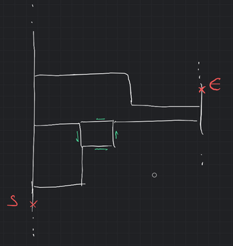
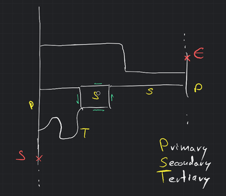
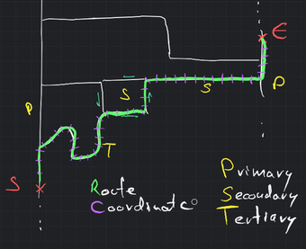
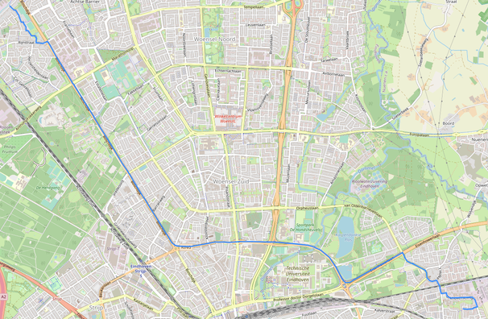

## Route Generation

### Tooling

During our exploration of tools for working with the OpenStreetMap (OSM) dataset, we evaluated various
options. Among the available choices, we concluded that Python is the most suitable language for our needs. Python,
when combined with libraries such as osmnx, networkx, and geopandas, provides a powerful toolkit for effectively
handling geospatial graph data, which aligns well with the node-way system of OSM.

The osmnx library is particularly valuable for our purposes. It allows us to retrieve and analyze OSM street network
data directly within Python. With osmnx, we can easily download street network data for specific regions or custom
areas, visualize the network, extract relevant information such as road types, and perform graph-based computations. It
simplifies the process of working with OSM data, providing a user-friendly interface for accessing and manipulating the
dataset. Meanwhile, Networkx offers extensive graph analysis and manipulation capabilities. It
provides a wide range of algorithms and functions to work with graphs, allowing us to perform complex network
operations, calculate shortest paths, and analyze connectivity within the OSM street network. The combination of osmnx
and networkx allows us to leverage graph theory to perform computations on the road network data.

Furthermore, geopandas complements the functionality of osmnx and networkx by providing tools for geospatial data
manipulation and analysis. It allows us to work with geospatial datasets, including the integration of OSM data with
other geospatial layers or datasets. Geopandas offers capabilities for spatial operations, data manipulation, and
spatial querying, enabling us to process and analyze the OSM data in a geospatial context.

### The Process

In our route generation process, we have established a methodology to simulate driving routes within a chosen area, such
as "Eindhoven, Noord-Brabant, Netherlands." The following steps outline our approach:

1. Area Selection: We specify a geographical area, such as Eindhoven, within which we want to generate routes.

2. Random Point Generation: Using the chosen area's boundaries, we generate two random points to represent the start and
   end locations of the route. These points ensure that the generated routes are diverse and cover various parts of the
   specified area.



3. Data Retrieval and Graph Construction: We utilize the osmnx library, which interfaces with the Overpass API, to
   download the relevant road network data for the chosen area. This data is used to construct a graph representation of
   the road network, which includes information about roads, intersections, and connectivity.



4. Shortest Route Calculation: Leveraging the networkx library, we apply dijkstra algorithm to determine the shortest
   route between the randomly generated start and end points. The calculation considers the "travel_time" property
   associated with roads, which osmnx adds to the graph. This ensures that the generated routes are optimized based on
   estimated travel times.

5. Route Segmentation: Once the shortest route is obtained, we divide the edges (ways) of the route into segments based
   on the "max_speed" property of each road segment. This segmentation allows us to simulate semi-realistic driving
   speeds, as different road segments may have varying speed limits.



6. Coordinate Extraction and File Storage: We extract the coordinates from the segmented route and save them as a list.
   These coordinate lists are then written to files, which can be stored in a cloud bucket or other storage solution.
   Storing the generated routes enables their utilization in simulations or subsequent processing steps.



7. Simulation: The simulations are ran in a C# application can access the stored files from the cloud bucket. During the
   simulation, the CarAPI is used to retrieve a random vehicle ID. Timestamps are added to the coordinates to
   indicate the progression of time during the simulated driving. The simulated coordinate batches are then sent to the
   RouterAPI, adhering to the determined intervals and batching strategy previously established.

```json
// A route file
[
  [
    5.5256206,
    51.4439927
  ],
  [
    5.5265028,
    51.4439773
  ],
  ...
  [
    5.5275152,
    51.443964
  ],
  [
    5.527566,
    51.4439827
  ]

```