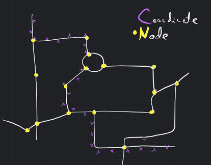
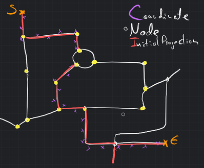
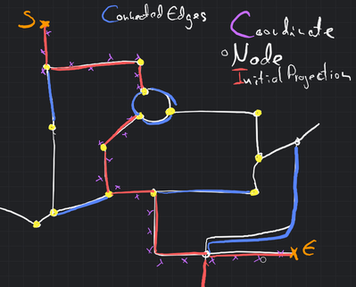
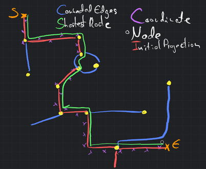

## Calculating Routes

_*\[Workshop]* How can we transform the tracker data back into a route?_

To transform the list of coordinates back into an OSM route, we again rely on the osmnx and networkx libraries. The
following
steps outline our approach:



1. Nearest Edge Determination: For each coordinate in the list, we use osmnx and networkx to identify the nearest edge
   on the graph. This ensures that each coordinate is associated with a specific road segment.



2. Start and End Node Identification: From the edges obtained in the previous step, we extract the start and end
   nodes of the route. These nodes serve as the endpoints for the subsequent route construction process.

3. Filling Missing Edges: To address any gaps that may occur during the projection of coordinates back to edges, we fill
   in the missing edges by considering all edges connected to any node within the route. This step ensures that the
   route remains continuous and prevents gaps from appearing in the final result. Typically, any gaps encountered are
   limited to a maximum of two edges in length.



4. Shortest Route Calculation: Once any missing edges have been filled, we perform another shortest route calculation
   using the networkx library. This calculation determines the final route, considering all the connected edges within
   the route.

> Inaccuracy and Acceptability: It is important to note that this transformation process may introduce slight
> inaccuracies in the final route. However, we have deemed these inaccuracies acceptable as they are always in favor of
> the driver. In other words, any discrepancies in the reconstructed route would result in a shorter path for the
> driver, which is seen as an acceptable deviation. If stricter accuracy requirements are necessary, further refinement
> of the process would be needed.
>


5. Conversion to Segment Format: Once the final route is determined, we convert it to the agreed-upon Segment(startNode,
   way, endNode) format. This format ensures consistency and compatibility across the Rekeningrijden microservice
   project.

6. Output: The transformed route, represented as a series of segments, is returned as the output of the transformation
   process. This output can then be utilized for further processing, pricing calculations, or any other relevant
   operations within the project.

```json
{
  "id": "b344e30e-6a32-4c2a-b2db-beae7f97142d",
  "priceTotal": 64.3,
  "segments": [
    {
      "time": "2023-07-21T17:32:28Z",
      "price": 64.3,
      "start": {
        "id": 0,
        "lat": 5.1756587,
        "lon": 51.5365524
      },
      "way": {
        "id": 0
      },
      "end": {
        "id": 0,
        "lat": 5.1756587,
        "lon": 51.5365524
      }
    }
  ]
}
```

By leveraging osmnx and networkx in this manner, we are able to transform the coordinate list back into an OSM route.
While there may be some slight inaccuracies, they are acceptable within the context of the project. The resulting route,
in the agreed-upon segment format, is suitable for use in the project, enabling seamless
integration and compatibility with other components of the system including other countries.