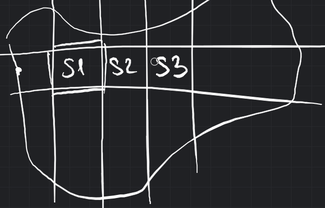
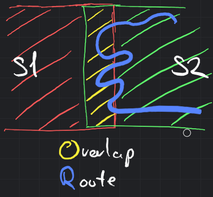
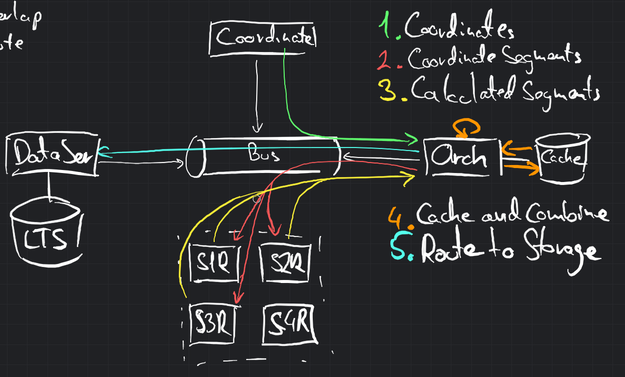
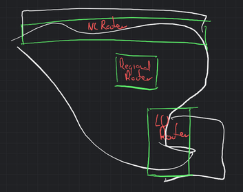

## Scalability

_*\[Workshop]* How can we ensure that transformation is scalable?_

### The Ideal Situation

To ensure scalability in the transformation process, particularly when dealing with large regions such as an entire
country like Belgium, we would use the following solution:

1. Division into Manageable Segments: Instead of keeping the entire OSM map in memory, we divide the country into
   manageable segments based on a grid system. Each segment represents a specific region within the country. The size of
   the segments is determined based on the memory constraints and processing capabilities of a single RouterService.
   Ideally, each segment should be small enough to fit into memory and be processed efficiently.

2. Overlapping Segments: To prevent constant handover of routes between different RouterServices, we allow slight
   overlap between neighboring segments. This ensures that routes that span across segment boundaries are still handled
   by a single RouterService, minimizing unnecessary communication and processing overhead.

3. Orchestrator Service: We introduce an orchestrator service that acts as a central coordinator for the route
   transformation process. The orchestrator receives the routes and coordinates to be processed.

4. Grid-based Routing: The orchestrator breaks down the routes based on the grid segments that the coordinates fall
   into. It then queues the segmented parts for processing on an event bus, ensuring that each segment is assigned to
   the appropriate RouterService instance.

5. RouterService Consumption: The individual RouterService instances consume the segments from the event bus that they
   can process efficiently. Each RouterService is responsible for transforming the coordinates within its assigned
   segment into OSM routes using the methods previously described.

6. Partial Route Completion: Once a RouterService completes processing a segment, it returns the completed part to the
   event bus. The orchestrator receives these completed segments and temporarily stores them in a cache.

7. Route Assembly: The orchestrator continuously checks the cache for completed segments. When all the parts of a route
   within a segment are completed, the orchestrator combines these segments, assembling the full route. It takes into
   account the order of the segments based on the route's original coordinates.

8. Price Calculation and Data Storage: The orchestrator also handles price calculation by aggregating the prices from
   the completed route segments. It sends the finalized route, including the combined segments and calculated prices, to
   the DataService for storage. This allows the route to be readily available for the FrontEnd or any other components
   of the system that require access to the transformed route data.

By implementing this scalable solution, we overcome the challenge of memory limitations when dealing with large regions
in the OSM dataset. The division into manageable segments, the use of an orchestrator service, and the grid-based
routing approach allow for efficient processing and transformation of routes.

### The Reality

Considering the constraints of time and resources, we have reassessed the scalability approach for dividing the country
into grid segments and implementing an orchestrator service. While the optimal solution outlined earlier provides a
robust framework, it requires significant development and implementation effort.

Given the limitations, we have made a practical decision to adopt a more simplified approach. Instead of dividing the
entire country into numerous grid segments, we will focus on running three RouterServices strategically:

1. Border Region with the Netherlands: We will have a dedicated RouterService to manage the border region with the
   Netherlands. This service will handle incoming requests from neighboring countries and process the corresponding
   parts of the routes that cross the border.

2. Border Region with Luxembourg: Similarly, we will set up another RouterService specifically for the border region
   with Luxembourg. This service will cater to requests from Luxembourg or any other neighboring country, allowing
   seamless integration with their systems and processing of relevant route segments.

3. Internal Region: The third RouterService will cover a specific region within the country, such as Brussels or any
   other significant area. This service will primarily handle our own routes and internal processing needs, ensuring
   efficient route transformation for our own vehicles and local operations.

By implementing these three RouterServices, we strike a balance between scalability and resource constraints. The
dedicated services for border regions enable interoperability with neighboring countries, facilitating the processing of
routes that involve cross-border travel. Simultaneously, the internal RouterService caters to our own route
requirements, providing streamlined and efficient transformations for our vehicles.

While this approach may not offer the extensive scalability and distributed processing envisioned in the optimal
solution, it provides a practical compromise that aligns with our available resources and timeline.